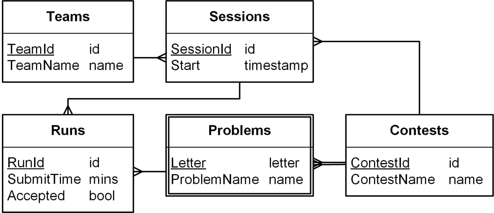

# Контрольная по запросам
## База данных

Схема базы данных «Соревнования по программированию».

В таблице Runs:
- SubmitTime – целое число минут, прошедших с начала соревнования;
- Accepted – 1, если зачтено, иначе 0.

Примеры исходных данных можно найти в тестовом полигоне.

## Запросы
Реализуйте запросы к базе данных «Соревнования по программированию»

1. Запишите следующие запросы в терминах реляционной алгебры и на языке SQL
   1. Идентификаторы команд, участвующих в соревновании (TeamId по :ContestId).
   2. Информация о подходах команды в соревновании (RunId, SessionId, Letter, SubmitTime, Accepted по :TeamId, :ContestId).
   3. Успешные подходы в соревновании (RunId, SessionId, Letter, SubmitTime по :ContestId).
   4. Команды, не решившие ни одной задачи ни в одном соревновании (TeamName).
   5. Команды, не решившие ни одной задачи хотя бы в одном соревновании (TeamName).
   6. Команды, не решившие ни одной задачи хотя бы в одном соревновании, в котором они участвовали (TeamName).
   7. Сессии, в которых есть подходы по всем задачам в соревновании (SessionId).
   8. Сессии, в которых решены все задачи соревнования (SessionId).
   9. Команды, решившие все задачи хотя бы в одном соревновании (TeamName).
   10. Задачи, которые решили все команды, участвовавшие в соревновании (ContestId, Letter).
2. Запишите следующие запросы на языках Datalog и SQL
   1. Команды, решившие задачу (TeamId по :ContestId, :Letter).
   2. Названия команд, решивших задачу (TeamName по :ContestId, :Letter).
   3. Команды, решившие хотя бы одну задачу в соревновании (TeamId по :ContestId).
   4. Задачи, не решённые ни одной командой (ContestId, Letter).
   5. Команды, решившие все задачи, решённые заданной командой (TeamId по :TeamId).
   6. Задачи, которые решили все команды, участвовавшие в соревновании (ProblemName).
3. Запишите изменяющие запросы на языке SQL
   1. Удалить все подходы соренования (ContestId).
   2. Удалить все подходы команды (TeamName).
   3. Для каждой команды, не участвовавшей в соревновании, добавить сессию с текущим временем начала (current_timestamp) (ContestId).
   4. Сделать последний подход в каждой сессии успешным (если в сессии есть хотя бы один подход).
   5. Сделать последний подход по каждой задаче в каждой сессии успешным (если есть подходы).
   6. Для каждой сессии, пытавшейся, но не решившей задачу, добавить успешный подход через минуту после последнего подхода по этой задаче. (ContestId).
   7. Для каждой команды сделать сессию для заданного соревнования с текущим временем начала. Если сессия уже существовала, то изменить время её начала. [Не проверяется на SQLite.] (ContestId).
4. Запишите агрегирующие запросы на языке SQL
   1. Число задач, решенных в каждой сессии (SessionId, Solved).
   2. Число различных задач, решенных командой (TeamId, Solved).
   3. Задачи соревнования, которые решили максимальное число команд (Letter по :ContestId).
   4. Для каждого соревнования, задачи, которые решило максимальное число команд (ContestId, Letter).
   5. Месяцы, в которые создано максимальное число сессий в формате месяц-год. [Не проверяется на SQLite.] (MonthStr).
   6. Для каждого соревнования найти команду, совершившую последний удачный подход (ContestId, TeamName, SubmitTime).
   7. Построить по соревнованию колонки «решено задач» и «штрафное время». Порядок команд должен быть правильным; при равенстве результатов — по возрастанию SessionId. (TeamName, Solved, Penalty по :ContestId).