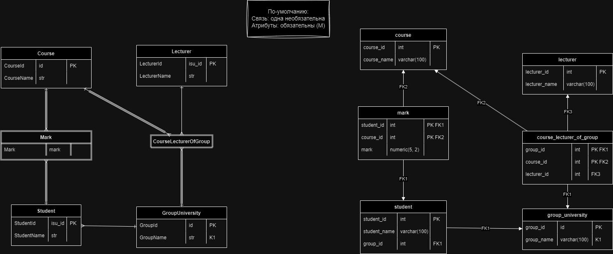

```
ФЗ
StudentId → StudentName, GroupId, GroupName;
GroupId → GroupName;
GroupName → GroupId;
CourseId → CourseName;
LecturerId → LecturerName;
StudentId, CourseId → Mark;
GroupId, CourseId → LecturerId, LecturerName.
```

### 1. Первая нормальная форма

#### 1.1. Описание
```text
Первая нормальная форма (1НФ):
- В отношении нет повторяющихся групп
- Все атрибуты атомарны
- У отношения есть ключ
_______________________

Изначальное отношение удовлетворяет условию. Декомпозировать не нужно.
```


#### 1.2. Результат

Для исходного отношения укажите на какие отношения вы его разбили в формате <br>
   `Исходное отношение => полученное отношение ; полученное отношение ; ... .` <br>
по одному на строке. Где все отношения заданы в формате <br>
   `(атрибут1, атрибут2, ...)` <br>
Например: <br>
   `(SellerId, GoodId, PriceId, OrderId) => (SellerId, GoodId, PriceId);  (GoodId, PriceId).` <br>
Обратите внимание на точку в конце описания. <br>
<br>
Строки, начинающиеся с двух минусов ( -- ) будут считаться комментариями. <br>
Разносить разбиение отношения на нескольк строк нельзя. <br>
Если отношение не изменилось, укажите его разбиение на одно отношение (его самого). <br>

```text
(StudentId, StudentName, GroupId, GroupName, CourseId, CourseName, LecturerId, LecturerName, Mark) => (StudentId, StudentName, GroupId, GroupName, CourseId, CourseName, LecturerId, LecturerName, Mark). 
```

### 2. Вторая нормальная форма

#### 2.1. Описание
```text
Вторая нормальная форма (2НФ):
- 1НФ
- Неключевые атрибуты функционально зависят от ключа в целом (не от части ключа)
- Неключевой атрибут – не входящий в ключ
_______________________

Есть ФЗ:
StudentId → StudentName, GroupId, GroupName;
GroupId → GroupName;
GroupName → GroupId;
CourseId → CourseName;
LecturerId → LecturerName;
StudentId, CourseId → Mark;
GroupId, CourseId → LecturerId, LecturerName.

Выделим отдельно отношение с ключом {CourseId, GroupId} из основного отношения, тогда выделяются неключевые атрибуты в отдельном отношении: 
LecturerId, LecturerName.
Получаются 2 отношения:
(StudentId PK, StudentName, GroupId, GroupName, CourseId PK, CourseName, Mark); 
(GroupId PK, CourseId PK, LecturerId, LecturerName). 

Второе отношение удовлетворяет условию 2НФ. Разделим первое отношение на 3 ключа:
{StudentId}, {CourseId}, {StudentId, CourseId}.

Последнему ключу отдадим оставшиеся неключевые атрибуты.

Получаем отношения:
(StudentId PK, CourseId PK, Mark); 
(CourseId PK, CourseName); 
(StudentId PK, StudentName, GroupId, GroupName); 
(GroupId PK, CourseId PK, LecturerId, LecturerName).
```

#### 2.2. Результат
Для каждого отношения из предыдущей нормальной формы укажите на какие отношения вы его разбили в формате, указанном в пункте 1.2.
```text
(StudentId, StudentName, GroupId, GroupName, CourseId, CourseName, LecturerId, LecturerName, Mark) => (StudentId, CourseId, Mark); (CourseId, CourseName); (StudentId, StudentName, GroupId, GroupName); (GroupId, CourseId, LecturerId, LecturerName).
```

### 3. Третья нормальная форма

#### 3.1. Описание
```text
Третья нормальная форма (3НФ):
- 2НФ
- Неключевые атрибуты непосредственно (не транзитивно) зависят от ключей

Приведение к 3НФ:
- Декомпозиция по последней ФЗ в цепочке
_______________________

Цепочки ФЗ, из которых можно что-то вынести:
1) 
StudentId → StudentName, GroupId, GroupName;
GroupId → GroupName. - выносим отдельно.

Также можно было вынести:
GroupName → GroupId
Поэтому GroupName и GroupId оба являются ключами в новом отношении.

2) 
GroupId, CourseId → LecturerId, LecturerName;
LecturerId → LecturerName. - выносим отдельно.

Всё остальное оставляем, как было.
```

#### 3.2. Результат
Для каждого отношения из предыдущей нормальной формы укажите на какие отношения вы его разбили в формате, указанном в пункте 1.2.
```text
(StudentId, CourseId, Mark) => (StudentId, CourseId, Mark).
(CourseId, CourseName) => (CourseId, CourseName).
(StudentId, StudentName, GroupId, GroupName) => (StudentId, StudentName, GroupId); (GroupId, GroupName).
(GroupId, CourseId, LecturerId, LecturerName) => (GroupId, CourseId, LecturerId); (LecturerId, LecturerName).  
```

### Б. Нормальная форма Бойса-Кодда

#### Б.1. Описание
```text
Нормальная форма Бойса-Кодда (НФБК):
- В каждой нетривиальной функциональной зависимости X→Y, X является надключом
__________________

"3НФ и неперекрывающиеся ключи ⇒ НФБК"
Для каждого неключевого атрибута в каждом отношении из 3НФ есть только один ключ.
Поэтому для НФБК ничего не меняется.
```

#### Б.2. Результат
Для каждого отношения из предыдущей нормальной формы укажите на какие отношения вы его разбили в формате, указанном в пункте 1.2.
```text
(StudentId, CourseId, Mark) => (StudentId, CourseId, Mark).
(CourseId, CourseName) => (CourseId, CourseName).
(GroupId, GroupName) => (GroupId, GroupName).
(StudentId, StudentName, GroupId) => (StudentId, StudentName, GroupId).
(GroupId, CourseId, LecturerId) => (GroupId, CourseId, LecturerId).
(LecturerId, LecturerName) => (LecturerId, LecturerName).
```

### 4. Четвёртая нормальная форма

#### 4.1. Описание
Для отношений из трёх и менее атрибутов должны быть приведены контрпримеры.
```text
Рассмотрим каждое отношение:

1) (StudentId, CourseId, Mark)
Только одна многозначная зависимость: StudentId, CourseId ->> Mark => отношение в 4НФ

2) (CourseId, CourseName)
По теореме Дейта-Фейгина 2: Отношение в НФБК, ключ {CourseId} - простой => отношение в 4НФ

3) (GroupId, GroupName)
По теореме Дейта-Фейгина 2: Отношение в НФБК, ключ {GroupId} - простой => отношение в 4НФ

4) (StudentId, StudentName, GroupId)
По теореме Дейта-Фейгина 2: Отношение в НФБК, ключ {StudentId} - простой => отношение в 4НФ

5) (GroupId, CourseId, LecturerId)
Только одна многозначная зависимость: GroupId, CourseId ->> LecturerId => отношение в 4НФ

6) (LecturerId, LecturerName)
По теореме Дейта-Фейгина 2: Отношение в НФБК, ключ {LecturerId} - простой => отношение в 4НФ
```

#### 4.2. Результат
Для каждого отношения из предыдущей нормальной формы укажите на какие отношения вы его разбили в формате, указанном в пункте 1.2.
```text
(StudentId, CourseId, Mark) => (StudentId, CourseId, Mark).
(CourseId, CourseName) => (CourseId, CourseName).
(GroupId, GroupName) => (GroupId, GroupName).
(StudentId, StudentName, GroupId) => (StudentId, StudentName, GroupId).
(GroupId, CourseId, LecturerId) => (GroupId, CourseId, LecturerId).
(LecturerId, LecturerName) => (LecturerId, LecturerName).
```

### 5. Пятая нормальная форма

#### 5.1. Описание
Для отношений из трёх и менее атрибутов должны быть приведены контрпримеры.
```text
Рассмотрим каждое отношение:

1) (StudentId, CourseId, Mark)
Нет нетривиальных зависимости соединений => отношение в 5НФ

2) (CourseId, CourseName)
По теореме Дейта-Фейгина 1: Отношение в 3НФ, 2 ключа {CourseId}, {CourseName} - простые => отношение в 5НФ

3) (GroupId, GroupName)
По теореме Дейта-Фейгина 1: Отношение в 3НФ, единственный ключ {GroupId} - простой => отношение в 5НФ

4) (StudentId, StudentName, GroupId)
По теореме Дейта-Фейгина 1: Отношение в 3НФ, единственный ключ {StudentId} - простой => отношение в 5НФ

5) (GroupId, CourseId, LecturerId)
Нет нетривиальных зависимости соединений => отношение в 5НФ

6) (LecturerId, LecturerName)
По теореме Дейта-Фейгина 1: Отношение в 3НФ, единственный ключ {LecturerId} - простой => отношение в 5НФ
```

#### 5.2. Результат
Для каждого отношения из предыдущей нормальной формы укажите на какие отношения вы его разбили в формате, указанном в пункте 1.2.
```text
(StudentId, CourseId, Mark) => (StudentId, CourseId, Mark).
(CourseId, CourseName) => (CourseId, CourseName).
(GroupId, GroupName) => (GroupId, GroupName).
(StudentId, StudentName, GroupId) => (StudentId, StudentName, GroupId).
(GroupId, CourseId, LecturerId) => (GroupId, CourseId, LecturerId).
(LecturerId, LecturerName) => (LecturerId, LecturerName).
```

### 6. Модели

#### 6. Диаграммы ERM и PDM
Картинка размером не больше 1920x1080. В левой половине — ERM. В правой — PDM. Для удобства чтения таблицы должны находиться на тех же местах, что и сущности/связи/ассоциации, из которых они получены. Рекомендуется использовать прямые линии (а не дуги) и избегать пересечений.

[db_homework4.drawio](db_homework4.drawio)


### 7. SQL
Помните, что SQL – это язык программирования, и не забывайте о форматировании и отступах

#### 7.1. DDL
```postgresql
create table group_university (
    group_id int not null,
    group_name varchar(100) not null,
    primary key (group_id),
    unique (group_name)
);

create table student (
    student_id int not null,
    student_name varchar(100) not null,
    group_id int not null,
    primary key (student_id),
    foreign key (group_id) references group_university(group_id)
);

create table lecturer (
    lecturer_id int not null,
    lecturer_name varchar(100) not null,
    primary key (lecturer_id)
);

create table course (
    course_id int not null,
    course_name varchar(100) not null,
    primary key (course_id)
);

create table course_lecturer_of_group (
    group_id int not null,
    course_id int not null,
    lecturer_id int not null,
    primary key (group_id, course_id),
    foreign key (group_id) references group_university(group_id),
    foreign key (course_id) references course(course_id),
    foreign key (lecturer_id) references lecturer(lecturer_id)
);

create table mark (
    student_id int not null,
    course_id int not null,
    mark numeric(5, 2) not null,
    primary key (student_id, course_id),
    foreign key (student_id) references student(student_id),
    foreign key (course_id) references course(course_id)
);
```

#### 7.2. DML
Пример тестовых данных. Достаточно 2-3 записей на таблицу, если они в полной мере демонстрируют особенности БД. Для удобства чтения данные должны быть записаны в том же порядке, что и в схеме.
```postgresql
insert into group_university
    (group_id, group_name) values
    (1, 'M32361'),
    (2, 'M34341');

insert into student
    (student_id, student_name, group_id) values
    (311645, 'Назаров Михаил Александрович', 2);

insert into lecturer
    (lecturer_id, lecturer_name) values
    (152885, 'Аксенов Виталий Евгеньевич'),
    (242347, 'Орешников Даниил Михайлович'),
    (105590, 'Корнеев Георгий Александрович');

insert into course
    (course_id, course_name) values
    (1, 'Дополнительные главы алгоритмов и структур данных'),
    (2, 'Проектирование баз данных');

insert into course_lecturer_of_group
    (group_id, course_id, lecturer_id) values
    (2, 1, 152885),
    (1, 1, 152885),
    (2, 2, 105590);

insert into mark
    (student_id, course_id, mark) values
    (311645, 1, 72.45),
    (311645, 2, 20);
```

